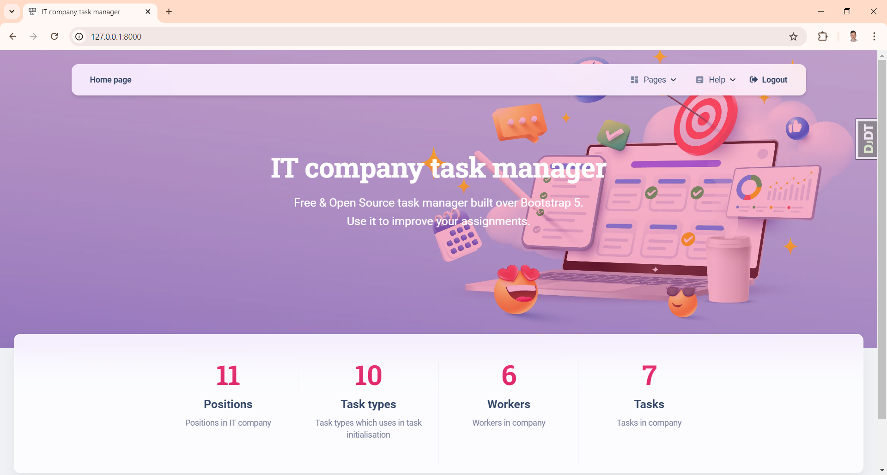

# It company task manager Project

Django project for managing projects in IT company

## Check it out!

[Task manager project deployed to Render](http://it-company-task-manager.render.com)

## Installation

Python 3 must be already installed

```commandline
git clone https://github.com/MaksymProtsak/it-company-task-manager.git
cd it_company_task_manager
python -m venv venv
venv\Scripts\activate
pip install -r requirements.txt
python manage.py runserver  # starts Django Server
```

## Features

* Authentication functionality for Worker/User
* Managing position of worker, task types, tasks, workers list directly from website interface
* Powerful admin panel form advanced managing

## Demo
